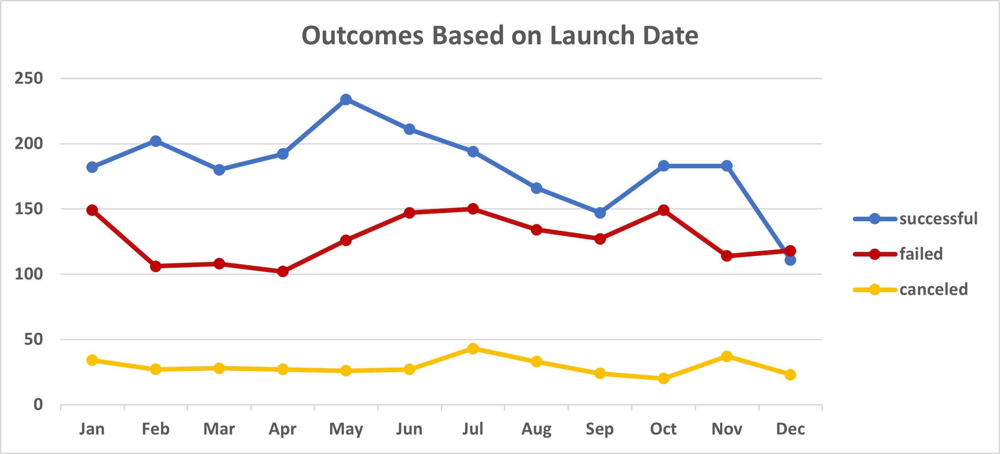
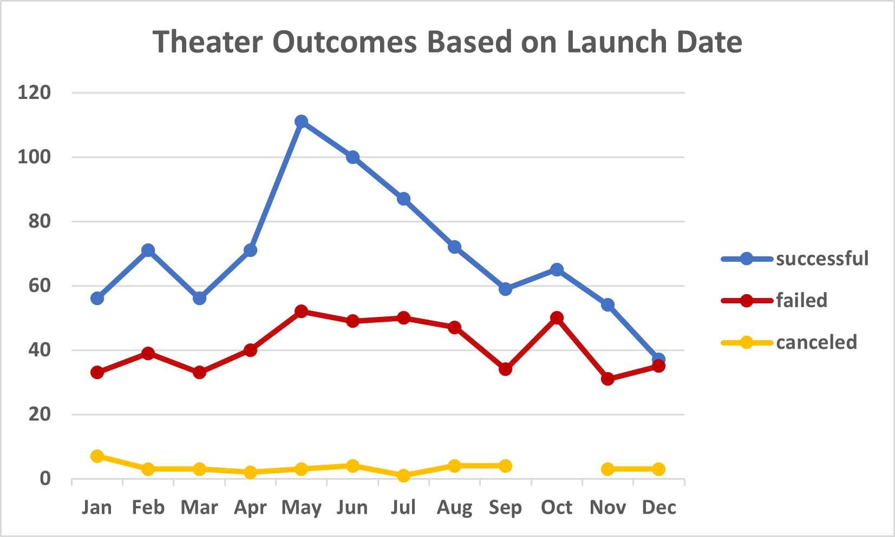
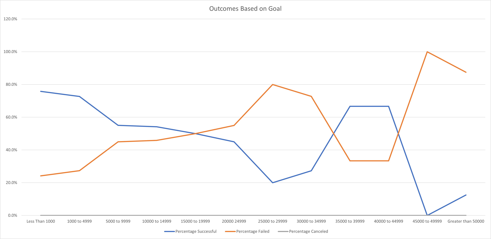

# Kickstarter-analysis

> Performing analysis on Kickstarter data to uncover trends

## Table of Contents:

- [Overview the Project](#overview-the-project)
- [Purpose](#purpose)
- [Analysis and Challenges](#analysis-and-challenges)
  - [Outcomes Based on Launch Date](#outcomes-based-on-launch-date)
  - [Outcomes Based on Goals](#outcomes-based-on-goals)
  - [Challenges and Difficulties Encountered](#challenges-and-difficulties-encountered)
- [Results](#results)

## Overview of the Project:

Retrieved the Kickstarter data of 4115 rows to let Louise can make the decision on how different campaigns fared in relation to their launch dates and their funding goals.

## Purpose project:

Based on the Kickstarter dataset, Louise's play Fever came close to its fundraising goal in a short amount of time. To achieve the goal of this project, she needs to understand of the successful campaigns from begin to end.

There are explicit elements that I separated from the information that we could use the technique to make Louise without a doubt, and successful in getting the funding. Utilizing these bits of knowledge for progress, by acquiring comprehension of the achievement from begin to end and reflecting efforts that were successful plays.

## Analysis and Challenges: 

[Kickstarter](https://help.kickstarter.com/hc/en-us/articles/115004996453-What-is-Kickstarter-) is a subsidizing stage for innovative activities. Everything from movies, games, and music to craftsmanship, plan, and innovation. Kickstarter is brimming with eager, creative, and innovatve thoughts that are rejuvenated through the immediate help of others.

For this part, we will focus on the Outcomes Based on Launch Date in general, and Theater Outcomes Based on Launch Date in particular. Besides, we also figure out the Outcomes Based on Goals to Understand that Kickstarter campaigns share new visions of work with communities.

### Outcomes Based on Launch Date
The following is a chart showing the Outcomes Based on Launch Date for the absolute accessible information.  We saw that the aggregate sum of every result (success, failed, canceled) for every month. The graph shows the maximum sum of each outcome as the successful column. Looking at the successful column, we can see that May has the highest number of successes and December has the lowest number of successes. Thereby, it can be concluded that the increase in the market is mainly concentrated in the summer and gradually decreases towards the end of the year. More notably, the successful column of December decreased more than the failed column in the same month.

Now let's narrow the scope to subcategories and count the aggregate sum of results for every month. So if we only focus on the Theater category as the charts show below.  We likewise get a similar pattern of May having the most elevated number of successes and December having the least measure of successes.

### Outcomes Based on Goals

| Goal               | Number Successful | Number Failed | Number Canceled | Total Projects | Percentage Successful | Percentage Failed | Percentage Canceled |
| ------------------ | ----------------- | ------------- | ----------------| -------------- | --------------------- | ----------------- | ------------------- |
| Less Than 1000     | 141               | 45            | 0               | 186            | 75.8%                 | 24.2%             | 0                   |
| 1000 to 4999       | 388               | 146           | 0               | 534            | 72.7%                 | 27.3%             | 0                   |
| 5000 to 9999       | 93                | 76            | 0               | 169            | 55%                   | 45%               | 0                   |
| 10000 to 14999     | 39                | 33            | 0               | 72             | 54.2%                 | 45.8%             | 0                   |
| 15000 to 19999     | 12                | 12            | 0               | 24             | 50%                   | 50%               | 0                   |
| 20000 to 24999     | 9                 | 11            | 0               | 20             | 45%                   | 55%               | 0                   |
| 25000 to 29999     | 1                 | 4             | 0               | 5              | 20%                   | 80%               | 0                   |
| 30000 to 34999     | 3                 | 8             | 0               | 11             | 27.3%                 | 72.7%             | 0                   |
| 35000 to 39999     | 4                 | 2             | 0               | 6              | 66.7%                 | 33.3%             | 0                   |
| 40000 to 44999     | 2                 | 1             | 0               | 3              | 66.7%                 | 33.3%             | 0                   |
| 45000 to 49999     | 0                 | 1             | 0               | 1              | 0%                    | 100%              | 0                   |
| Greater than 50000 | 2                 | 14            | 0               | 16             | 12.5%                 | 87.5%             | 0                   |

Based on the data in the table and chart above, Louise is likely to achieve the best results when she reaches her goal between $1000 and $4999. Although this goal has the highest number of failures, it is the difference between success and failure is huge. So Louise can completely choose this goal. In addition, we can see a goal of over $45000, which is completely unlikely to succeed, which is something that we need to be careful about in decision making.

### Challenges and Difficulties Encountered

I went through challenges and difficulties:
   - I am completely inexperienced in using Github for data analysis. It took me a long time to finish this first post. In addition, using data in Excel for analysis is also a new experience for me. I am an accountant, I used to use Excel only to calculate numbers, now I have a new job that is to use data for analysis. I find it very interesting and hope to succeed.
   
   - The Kickstarter datasheet is almost complete and makes it easy for me to analyze. It was a bit difficult to retrieve the information at first, but once I understood the problem and found the right solution.
     
## Results project

- What are two conclusions you can draw about the Outcomes based on the Launch Date?

> With the data provided from Outcomes based on Launch Date, when using functions in Excel such as applying filters, conditional formatting, and converting dates for easier reading. As analyzed above, I think Louise should launch her campaign in May. She can launch from mid-April and see it as a stepping stone to organize things smoothly. The campaign can last from May to June, this is considered the best time because it has a high success rate for all categories in general and the theaters category in particular.

> The second thing, I think Louise should pay close attention to is finding solutions to increase efficiency and success in the last months of the year. Through the use of the filter function, we can easily find out why the success rate is low. We are still too focused on the US market (the number of successful times in the US is 89 times), so to improve this situation, Louise needs to deploy many new activities to stimulate demand from other countries.

- What can you conclude about the Outcomes based on Goals?

> The line chart shows that a high chance of success if we concentrate on the budget from $1000 to $20,000. This investment amount is reasonable because the probability of success is high, and it does not cause too great a loss. So with the analysis we did on the data and narrowing it down to different target groups, I recommend Louise try budgeting the play under $10,000.

- What are some limitations of this dataset?

> The focus on the US market causes an imbalance for the project. Louise needs to rebalance to be able to achieve high efficiency for this project.

> Some of the information in this data has not been used like Average Contribution, Backers, Pledge, etc..

- What are some other possible tables and/or graphs that we could create?

> I think to maximize the data, we should tabulate the data showing the percentage instead of just the number of values in the columns.
